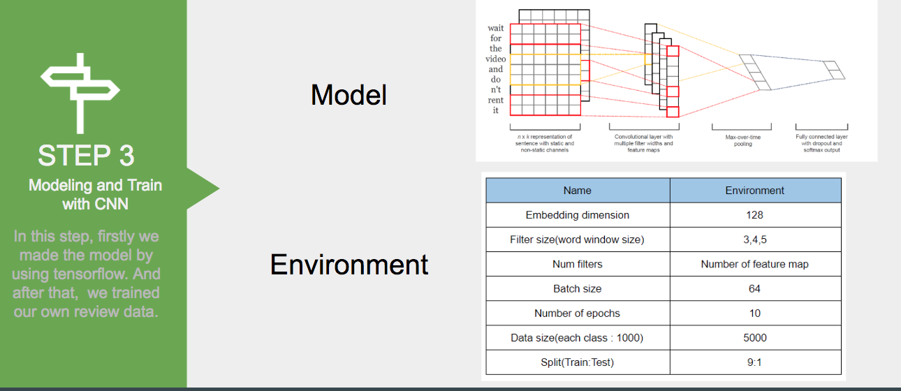

# prediction-review-rating
## Subtitle : Text Classification using RNN and CNN
## Description
Based on product reviews, we want to see how a review relates to ratings.
In this project, a big topic called Text classification is implemented using two models.
First, we implemented the LSTM model using Keras and train the binary classification. And the CNN model was implemented using Tensorflow to train and test multiple classification.
We tested the post-learning using LSTM, which is a type of RNN known as a representative text processing model.
Next, we implemented multiple text classification using CNN, which is mainly used for image processing. 
In conclusion, we have tested the possibility of how much performance can be expressed by text classification using RNN and CNN, which are representative algorithms of deep learning, and how much of the learning result, in this project .
Especially, in order to process texts of CNN that performs image processing, the order of appearance of words and expressions is reflected in learning by preserving local information of sentences.

## Requirements
* Flask for web server
* Jupyter for running python program and leraning rnn/cnn
* tensorflow
* keras

## How to use our program
### Run the Web Application
```
$ python3 web.py
```
### Must Change!
1. In app/model/checkout, change a path
2. paths of dataset

### Learn model
If you get dataset and model ipynb files and change the path of dataset, you can
learn cnn or rnn model using dataset.

## Software(or Overall Application) Architecture


## Process and Result of CNN and RNN
### CNN
#### Step1

#### Step2

#### Step3

#### Result


### RNN
#### Step1

#### Step2

#### Result


## References
- [Understanding LSTM Networks](http://colah.github.io/posts/2015-08-Understanding-LSTMs/)
- [How to Use Word Embedding Layers for Deep Learning with Keras](https://machinelearningmastery.com/use-word-embedding-layers-deep-learning-keras/)
- [What optimization methods work best for LSTMs?](https://www.reddit.com/r/MachineLearning/comments/3i6fp9/what_optimization_methods_work_best_for_lstms/)
- [rnn vs cnn stackoverflow](https://datascience.stackexchange.com/questions/11619/rnn-vs-cnn-at-a-high-level)
- [CNN text classification Implementation Github](http://www.wildml.com/2015/12/implementing-a-cnn-for-text-classification-in-tensorflow/)
- [Convolutional Neural Networks for Sentence Classification](https://arxiv.org/abs/1408.5882)
- kernel
  - https://www.kaggle.com/PromptCloudHQ/amazon-reviews-unlocked-mobile-phones/kernels
  - https://www.kaggle.com/ngyptr/lstm-sentiment-analysis-keras
  - https://www.kaggle.com/kredy10/simple-lstm-for-text-classification
- papers
  - [Learning Recurrent Neural Networks with Hessian-Free Optimization](http://www.icml-2011.org/papers/532_icmlpaper.pdf)
  - [Recurrent Neural Network for Text Classification with Multi-Task Learning](https://www.ijcai.org/Proceedings/16/Papers/408.pdf)

## Team Member
* Dokyeong Kwon
* Seungwoo Park
* Taeseung Lee
